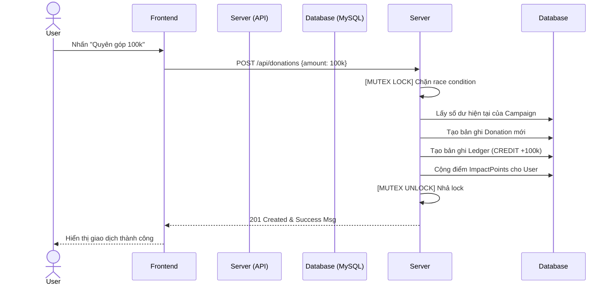

# KindWave - Nền tảng Gây quỹ & Tình nguyện Minh bạch 🌊

KindWave là một dự án phần mềm hướng đến giải quyết bài toán minh bạch tài chính trong các hoạt động kêu gọi từ thiện. Hệ thống sử dụng mô hình "Sổ cái" (Ledger) để ghi nhận từng biến động dòng tiền không thể xóa bỏ, kết hợp với các chỉ số báo cáo trực quan và hệ thống Gamification thu hút cộng đồng.

## 🚀 Công nghệ sử dụng
- **Frontend**: React 18, Tailwind CSS, Recharts (Biểu đồ thống kê).
- **Backend**: Node.js, Express, JSON Web Token (JWT).
- **Database**: Hỗ trợ chạy Hybrid. Tự động dùng file JSON nếu không có cấu hình MySQL. Tự động đồng bộ và sử dụng **MySQL** nếu có `.env`.
- **Quality Assurance**: 
  - `Vitest` & `@vitest/coverage-v8` cho Unit Testing.
  - `GitHub Actions` cho luồng CI tự động hóa.
  - Cấu hình `SonarQube` đánh giá tĩnh mã nguồn.

---

## 🛠️ Hướng dẫn cài đặt và chạy hệ thống

### 1. Yêu cầu hệ thống
- Node.js (v18+)
- MySQL Server (XAMPP / MySQL Workbench)

### 2. Các bước cài đặt
```bash
# Clone repository
git clone <url-repo-cua-ban>

# Cài đặt thư viện
npm install
```

### 3. Cấu hình Cơ sở dữ liệu (MySQL)
Mở phần mềm MySQL của bạn, tạo database:
```sql
CREATE DATABASE kindwave_db CHARACTER SET utf8mb4 COLLATE utf8mb4_unicode_ci;
```
Đổi tên file `.env.example` thành `.env` (hoặc tạo file `.env` mới ở thư mục gốc) và điền cấu hình:
```env
MYSQL_HOST=localhost
MYSQL_PORT=3306
MYSQL_DATABASE=kindwave_db
MYSQL_USER=root
MYSQL_PASSWORD=17112005
```

### 4. Đồng bộ dữ liệu mẫu & Khởi chạy
Chạy script đẩy dữ liệu JSON mẫu vào MySQL:
```bash
npx tsx scripts/migrateToMySQL.ts
```
Khởi chạy máy chủ:
```bash
npm run dev
```
> Trình duyệt sẽ chạy hệ thống tại địa chỉ: **http://localhost:3000**

---

## 📖 Tài liệu API
Một số Endpoint chính được thiết kế chuẩn RESTful.
- **POST `/api/auth/register`**: Tạo tài khoản (Role mặc định luôn là USER).
- **POST `/api/auth/login`**: Đăng nhập, trả về JWT.
- **GET `/api/campaigns`**: Lấy danh sách chiến dịch gây quỹ.
- **POST `/api/donations`**: Gửi tiền quyên góp (Cập nhật Sổ cái Ledger).
- **POST `/api/images/upload`**: Upload hình minh chứng (Dạng multipart/form-data).

---

## 🔄 Sơ đồ quy trình (Nghiệp vụ Quyên góp)



## 🧪 Chạy Test và Xuất Báo Cáo Bao Phủ (Coverage)
Để chạy các bộ Black-box API tests, bạn phải **bật máy chủ (`npm run dev`)** ở một terminal khác trước. Sau đó chạy:
```bash
npm run test -- --coverage
```
Hệ thống sẽ chạy qua 15 test cases (Bao gồm test chống lỗ hổng Privilege Escalation, User Enumeration) và sinh báo cáo trong thư mục `coverage/`.
